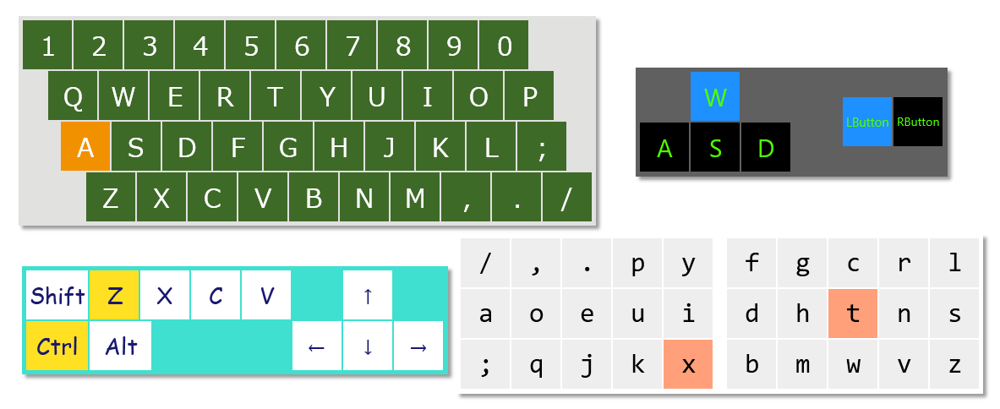
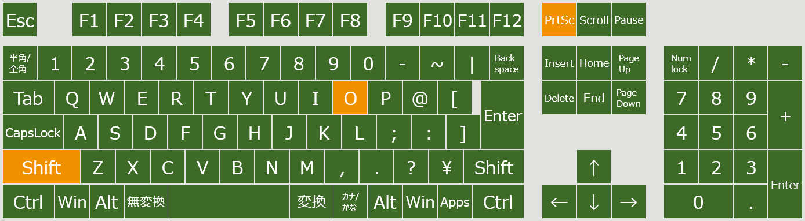

# Custom Input Monitor

キーボードとマウスの入力をリアルタイムに表示するアプリです。
レイアウトをカスタマイズできます。

### 動作環境

* Windows10+
* .NET 6

## 操作方法

### モニタリングパネルの追加

1. Enter キーを押すと「Press a KEY or a MOUSE BUTTON to monitor」と表示されます。  
(Fnキーを使った複合入力をモニタリングする場合、Enter のかわりに Fn + Enter を押し、Fnキーを押しっぱなしにしてください)
2. キーまたはマウスのボタンを押します。
3. 左上にパネルが追加されます。  
※キーコードなどの動作によって、一気に複数のパネルが追加される場合があります。

### 表示テキストの編集

パネルをダブルクリックしてください。

### パネルの削除

パネルをクリックしてDeleteキーを押してください。

### レイアウトの保存と読み込み

パネルの配置を保存する場合、アプリを閉じた後に CustomInputMonitor.exe と同じフォルダ内にある layout.cinm をコピーして別名で保存してください。
.cinm ファイルを CustomInputMonitor.exe にドロップすると、保存したパネルレイアウトを読み込みます。

日本語キーボードの一般的な配列 jis.cinm を同梱しています。(誰かUSキーボード配列作って…)

### 色とフォントのカスタマイズ

theme.json をテキストエディタなどで開いて変更してください。

---

## System requirements

* Windows10+
* .NET 6

## Summary

This app monitors keyboard and mouse input in real time.
You can customize the layout.

## Instructions

### Add monitoring panel

1. Press the Enter key to display "Press a KEY or a MOUSE BUTTON to monitor".  
(If you want to monitor compound input using the Fn key, press Fn + Enter instead of Enter and hold Fn.)
2. Press a key or a mouse button that you want to monitor
3. A panel that monitors the target key or button will be added to the upper left.

### Edit text

Double-click the panel.

### Remeve panel

Click the panel and press delete.

### Save and load layout

To save the panel layout, close the app and copy layout.cinm (located in the same folder as CustomInputMonitor.exe) and rename it.
Drop the .cinm file into CustomInputMonitor.exe to load the saved panel layout.

### Customize colors and fonts

Modify theme.json with a text editor.